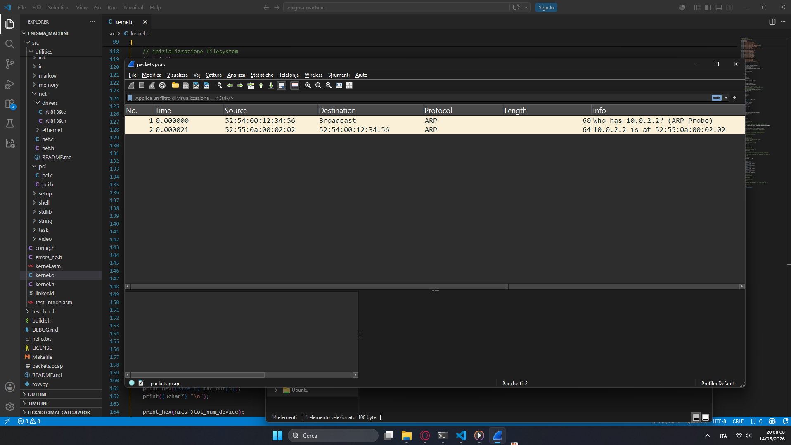
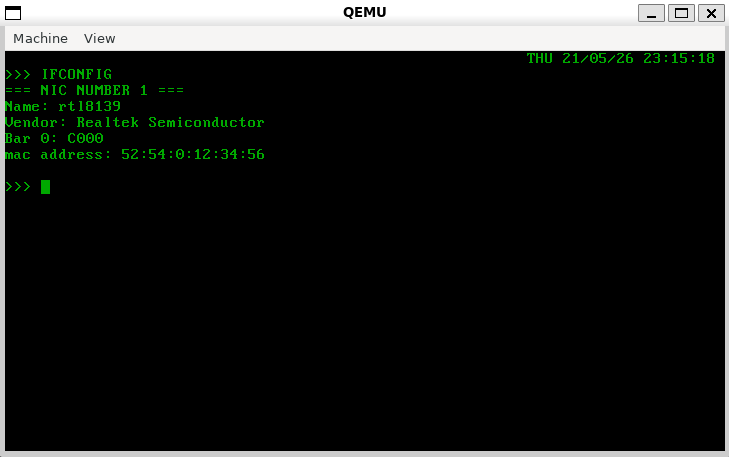

# Kernel network

### Descrizione

L'idea sostanziale in questo progetto e' di far comunicare due macchine enigmaOs in rete per lo scambio di messaggi crittografati. Appena arrivano all'altra macchina (avendo stessi rotori, riflettore, plugboard), ritraduce il messaggio crittografato e lo mostra a schermo

### Requirements (minimo)

- Inizializzato e configurato il pic (sia master che slave)
- Heap memory (algoritmo slab allocator, sconsiglio vivamente waterMarker)
- Paging memory (`virt addr` = `phisical addr` per semplicita')
- Devi modificare il Makefile (l'esecuzione del comando di qemu) in questo modo:

```Makefile
run:
    sudo qemu-system-x86_64 \
		-hda ./bin/os.bin \
		-netdev user,id=n1 \
		-device rtl8139,netdev=n1 \
		-object filter-dump,id=f1,netdev=n1,file=packets.pcap \
		-vga std \
        -device virtio-gpu \
		-d guest_errors,unimp
```


### Stack protocollare (TCP/IP)

| nome layer        | descrizione                        | protocolli              |
|-------------------|------------------------------------|-------------------------|
| applicazione      | servizi utente                     | HTTP, DNS, DHCP         |
| trasporto         | comunicazione processo-processo    | TCP, UDP                |
| internet          | routing tra reti                   | IPv4, ICMP              |
| link / data link  | consegna locale su LAN             | Ethernet, ARP           |
| fisico            | trasmissione segnali               | driver NIC              |

# How to get device network interface controllers

All'avvio il kernel non conosce quali dispositivi sono presenti e quali no.
Il nostro obbiettivo quindi e' sapere come ottenere le informazioni di tutti i dispositivi collegati al pci (sapere id vendor, id device, subsystem class).

- id vendor
- id device
- subsystem class

Per conoscerli, il kernel deve interrogare il pci (collegando la cpu con le periferiche interne usando la scheda madre).

Il pci funziona come un array tridimensionale:

il primo layer è composto da 256 bus, ogni bus è un array di 32 elementi chiamati slot (ogni slot rappresenta un dispositivo).

Ogni slot a sua volta è composto da un array di 8 elementi chiamati functions (funzionalità disponibili di un dispositivo).

Le funzioni base per interrogare il pci sono outl (output long) e insl (input software long).

Si trovano all'interno del file **utilities/io/io.asm**:

```S
; u32 insl(u16 port);
insl: push ebp
    mov ebp, esp

    xor eax, eax
    mov edx, [ebp + 8]
    in eax, dx

    pop ebp
    ret


; void outl(u16 port, u32 value);
outl: push ebp
    mov ebp, esp
        
    mov eax, [ebp + 12]
    mov edx, [ebp + 8]
    out dx, eax 
        
    pop ebp
    ret
```

- ```insl```: serve per ricevere informazioni dall'hardware tramite un codice identificativo del dispositivo richiesto e resituisce un valore

- ```outl```: serve per inviare informazioni all'hardware passandogli il codice identificativo del dispositivo richiesto e il valore da mandare


### ```pci_read_32()```

Si basa sul concetto di bus, slot, func e offset (gate del dispositivo).

```C
u32 pci_read32(u8 bus, u8 slot, u8 func, u8 offset);
```
I dispositivi usano dei registri che si trovano a un determinato offset (detti gate)

I gate di riferimento in questo contesto sono:

- gate **0xCF8** (CONFIG_ADDRESS) -> Quale device PCI vuoi interrogare?
- gate **0xCFC** (CONFIG_DATA) -> risultato dell'interrogazione a CONFIG_ADDRESS

Quindi:

```C
#define CONFIG_ADDRESS 0xCF8
#define CONFIG_DATA 0xCFC


u32 pci_read32(u8 bus, u8 slot, u8 func, u8 offset)
{
    u32 address;

    address = (u32) (1 << 31)         |
        ((u32) bus  << 16)            |
        ((u32) slot << 11)            |
        ((u32) func << 8)             |
        ((u32) (offset & 0xFC));

    outl(CONFIG_ADDRESS, address);
    return insl(CONFIG_DATA);
}
```

Tuttavia, non tutti gli slot di tutti i bus sono effettivamente occupati da un dispositivo.

Questo significa che dobbiamo creare un meccanismo simile bruteforce dove si scorre per tutti gli slots presenti sui bus per recuperare le informazioni.

Per capire se sono dei dispositivi veri (nel senso che quello slot e' occupato davvero da un dispositivo), basta ottenere il ```vendorId``` del prodotto, che va a identificare il dispositivo:

```C
for (u16 bus = 0; bus < 256; bus++) {
    for (u8 slot = 0; slot < 32; slot++) {
        for (u8 func = 0; func < 8; func++) {
            u16 vendor = pci_get_vendor(bus, slot, func);
            // ...
        }
    }
}
```

pci_get_vendor restituisce 0xFFFF se lo slot è vuoto, vendorId altrimenti:

```C
u16 pci_get_vendor(u8 bus, u8 slot, u8 func)
{
    return (u16) (pci_read32(bus, slot, func, 0x00) & 0xFFFF);
}
```

Il gate per ottenere il vendorId è 0x00.

Quindi, chiamando pci_get_vendor bisogna eseguire un check se è PCI_NONE (0xffff).

```C
#define PCI_NONE 0xFFFF
#define DEVICE_INESISTENTE(vendor) (vendor == PCI_NONE)

for (u16 bus = 0; bus < 256; bus++) {
    for (u8 slot = 0; slot < 32; slot++) {
        for (u8 func = 0; func < 8; func++) {
            u16 vendor = pci_get_vendor(bus, slot, func);

            if (DEVICE_INESISTENTE(vendor))
                continue;

            // ...
```

Così tutti gli slot vuoti vengono skippati, gli altri invece vengono considerati.

Quello che dobbiamo fare ora e' collezionare tutti i dati all'interno del pci, memorizzando bus, slot, func, vendor, device, priv (capirete dopo, un passo alla volta), class_code, subclass, priv_methods (capirete anche questo dopo) e BAR0 a BAR5.

```C
struct pci_bar {
    u64 addr;   // indirizzo bar
    u8 type;    // 0 = MMIO, 1 = IO
    u8 is64;    // e' indirizzo a 64 bit o a 32?
};


/*
*  @bus -> quale bus del pci    // asse x
*  @slot -> idx device          // asse y
*  @func -> idx func device     // asse z
*
*  @vendor -> identificativo del produttore hardware
*  @device -> device id (modello specifico del dispositivo)
*  @class_code -> categoria generale hardware (nic)
*  @subclass -> sottocategoria specifica del dispositivo (ethernet controller, )
*  @priv -> ptr a struct con caratteristiche specifiche del device
*  @priv_method -> metodi usabili sul device
*/

struct pci_device {
    u16 bus;
    u8 slot;
    u8 func;
    
    u16 vendor;
    u16 device;

    void* priv;

    u8 class_code;
    u8 subclass;

    void* priv_methods;

    struct pci_bar bar[6];
};


/*
* struct virt_pci_dev:
* @dev -> lista di tutti i dispositivi
* @tot_num_device -> numero di dispositivi rilevati
*/
struct virt_pci_dev {
    struct pci_device *dev;
    size_t tot_num_device;
};
```

Quello che voglio fare e' separare i tipi di dispositivi analizzati (gpu, nics, massStocs, brcs) e' man mano che smistarli in questi array dinamici:

```C
/* pci controller device struct */
typedef struct virt_pci_dev pci_dev_list_t;

// array di gpu device
pci_dev_list_t* gpus = NULL;

// array di network interface controller
pci_dev_list_t* nics = NULL;

// array di Mass storage controller
pci_dev_list_t* massStocs = NULL;

// array di bridge controller
pci_dev_list_t* brcs = NULL;

```

Creiamo ora una struct pci_device che colleziona provvisoriamente le informazioni:

```C
for (u16 bus = 0; bus < 256; bus++) {
    for (u8 slot = 0; slot < 32; slot++) {
        for (u8 func = 0; func < 8; func++) {
            struct pci_device dev = {0};

            dev.bus         = bus;
            dev.slot        = slot;
            dev.vendor      = vendor;
            dev.func        = func;

            // deviceId
            dev.device      = pci_get_device(bus, slot, func);
            // tipo dispositivo
            dev.class_code  = pci_get_class(bus, slot, func);
            // tipo specifico del tipo di dispositivo
            dev.subclass    = pci_get_subclass(bus, slot, func);

```

Abbiamo introdotto tre nuove funzioni:

```pci_get_device()```

Il Device ID occupa i bit 16-31 del registro offset 0x00.

|u32 vendor = |   Device Id   |   **```Vendor Id```**  |
|-------------|---------------|------------------------|
|             |  bits 31-16   |  **```bits 15-00```**  |


Quindi:

```C
u16 deviceId = (u16) ((pci_read32(bus, slot, func, 0x00) >> 16) & 0xFFFF)
```

```pci_get_class()```

Per ottenere la classe, bisogna interrogare il gate 0x08 del pci

|u32 inform = |  **```Class Code```**   |   subclass   | ProgIf | RevisionId |
|-------------|-------------------------|--------------|--------|------------|
|             |  **```bits 31-24```**   |  bits 23-16  |  15-8  |    7-0     |

quindi, per ottenere tutte le informazioni dal gate 0x08:

```C
u8 classCode = (u8) ((pci_read32(bus, slot, func, 0x08) >> 24) & 0xFF);
u8 subclass = (u8) ((pci_read32(bus, slot, func, 0x08) >> 16) & 0xFF);
u8 progIf = (u8) ((pci_read32(bus, slot, func, 0x08) >> 8) & 0xFF);
u8 revisionId = (u8) ((pci_read32(bus, slot, func, 0x08) >> 0) & 0xFF);
```

A questo punto le inseriamo tutte all'interno della classe struct pci_device:

```C
struct pci_device dev = {0};

dev.bus         = bus;
dev.slot        = slot;
dev.vendor      = vendor;
dev.func        = func;

dev.device      = pci_get_device(bus, slot, func);
dev.class_code  = pci_get_class(bus, slot, func);
dev.subclass    = pci_get_subclass(bus, slot, func);
```

Non ci resta altro ora che popolare i campi da bar0 a bar5.

I bar (base addess registers) indicano dove sono esposti i registri hardware del device.

```C
void pci_read_bars(struct pci_device *dev, u16 bus, u8 slot, u8 func);
```

Questi registri consentono di interagire con il dispositivo vero e proprio.

Ogni bar puo' rappresentare:
- una regione I/O (port mapped I/O)
- una regione mmio (memory mapped I/O)

Esempio con la scheda di rete rtl8139 (classica e conosciuta per la sua semplicita'):
BAR0 della rtl8139 (secondo lo standard e la documentazione) si trova a indirizzo 0xC000.

Questo significa che i suoi registri sono accessibili tramite le funzioni insb (input software byte) e outb(output byte) a partire dall'indirizzo 0xC000 in poi.

Quindi, andiamo a ottenere ogni registro di ogni bar e lo catturiamo all'interno della struct pci_bar[idx] (che si trova all'interno di device_pci)


Una volta che abbiamo fatto questo non ci resta che inserire le informazioni raccolte all'interno dell'array dei dispositivi corretto (se il dispositivo e' ```gpu``` si inserisce in ```pci_dev_list_t* gpus```, se invece e' una ```scheda di rete``` si inserisce in ```pci_dev_list_t* nics```, etc...).

Quindi, bisogna usare la funzione ```pci_memorize_device```:

```C
void pci_memorize_device(struct pci_device *dev)
{
    /*
    *  classi:
    *      0x01 -> Mass Storage Controller (dispositivo di archiviazione)
    *      0x02 -> Network Controller
    *      0x03 -> Display Controller
    *      0x06 -> Bridge Device
    */
    switch (dev->class_code) {
        case 0x00:
            break;  // dispositivo non riconosciuto
        case 0x01:
            massStocs = dynamic_insert_in_struct(massStocs, dev);
            break;
        case 0x02:
            nics = dynamic_insert_in_struct(nics, dev);
            break;
        case 0x03:
            gpus = dynamic_insert_in_struct(gpus, dev);
            break;
        case 0x06:
            brcs = dynamic_insert_in_struct(brcs, dev);
            break;    
        default:
            return;
    }
}
```

Quindi, alla fine la funzione ```search_all_device_pci``` sara' fatta cosi':

```C
void search_all_device_pci()
{
    for (u16 bus = 0; bus < 256; bus++) {
        for (u8 slot = 0; slot < 32; slot++) {
            for (u8 func = 0; func < 8; func++) {
                u16 vendor = pci_get_vendor(bus, slot, func);

                if (DEVICE_INESISTENTE(vendor))
                    continue;

                struct pci_device dev = {0};

                dev.bus         = bus;
                dev.slot        = slot;
                dev.vendor      = vendor;
                dev.func        = func;

                dev.device      = pci_get_device(bus, slot, func);
                dev.class_code  = pci_get_class(bus, slot, func);
                dev.subclass    = pci_get_subclass(bus, slot, func);

                pci_read_bars(&dev, bus, slot, func);
                pci_memorize_device(&dev);
                pci_enable_device(&dev);

            }
        }
    }
}
```

Bisogna ora attivare il dispositivo sul pci. Per fare questo, possiamo creare una funzione chiamata ```pci_enable_device()```:

```C
void pci_write32(u8 bus, u8 slot, u8 func, u8 offset, u32 value)
{
    u32 address =
        (1U << 31) |
        ((u32) bus << 16) |
        ((u32) slot << 11) |
        ((u32) func << 8) |
        (offset & 0xFC);

    outl(0xCF8, address);
    outl(0xCFC, value);
}


void pci_enable_device(struct pci_device* dev)
{
    // Abilita il dispositivo sul BUS PCI.
    u32 reg = pci_read32(dev->bus, dev->slot, dev->func, 0x04);

    // CPU può usare in/out sui BAR I/O
    reg |= (1 << 0); // I/O Space

    // NIC può fare DMA sulla RAM
    reg |= (1 << 2); // Bus Master

    pci_write32(dev->bus, dev->slot, dev->func, 0x04, reg);
}
```


## **IMPLEMENTAZIONE LIVELLO 1 (FISICO)**

Ogni nic ha il suo modo di funzionare.

Quindi dobbiamo creare dei driver specifici per ogni tipo di scheda di rete.

Io ho risolto questo problema aggiungendo un layer al livello fisico che chiamo "virtuale".

Si occupa lui di capire e instradare verso il driver corretto per il nic, permettendomi nei livelli superiori di trattare tutti i dispositivi nic come se fossero un oggetto identico:

```C
/*        mappa concettuale:
*
*                ...
*                 |
*            vsend_nic()
*            /    |    \
*           /     |     \
*   driver_1.c    |      rtl8139.c
*                 |
*             driver_2.c
*/
```

Stesso ragionamento vale per il recv:

```C
/*        mappa concettuale:
*
*                ...
*                 |
*            vrecv_nic()
*            /    |    \
*           /     |     \
*   driver_1.c    |      rtl8139.c
*                 |
*             driver_2.c
*/
```

Quello che bisogna fare ora e' inizializzare ogni scheda di rete presente nell'array nics.

```C
extern pci_dev_list_t* nics;


void init_scheda_rete()
{
    for (size_t idx = 0; idx != nics->tot_num_device; idx++)
        init_nic_driver(&nics->dev[idx]);
}
```

# Identificazione del nic

Per verifica il dispositivo dobbiamo basarci sul vendorId e IdDevice:

```C
#define IS_RTL8139_CHIP(nic) (nic->vendor == 0x10EC && nic->device == 0x8139)

void init_nic_driver(struct pci_device* nic)
{
    if (IS_RTL8139_CHIP(nic)) {
        init_rtl8139(nic);
        return;
    }

    // else if () {
    //      ...
    //      goto out;
    // }
    // etc...

    return;
}
```

Se la condizione risulta vera, significa che il chip e' l'rtl8139 e che quindi bisogna configurarlo tramite il driver per rtl8139.

Ogni dispositivo ha i suoi metodi e i suoi attributi e ogni driver fornisce delle informazioni / esegue codice nello specifico per quel chip. Tuttavia, tutti i chip nic DEVONO fare i seguenti steps all'accensione:

- **reset**: elimino possibili rimasugli dei rigistri causati dall'ultima accensione del nic
- **power_on**: accensione del nic (diverso da abilitare lo slot pci)
- **init_rx_buffer**: dice dove depositare in ram i dati ricevuti


nella struct pci_device e' presente ```@device->priv``` che è di tipo **void*** che punta a una struct (si esegue il cast di tipo nel driver) specifica del dispositivo.

Per l'rtl8139 ```@device->priv``` punta a una ```struct rtl8139_device```:

```C
#define RX_RING 8192
#define ALIGNMENT 16 
#define MAXETHFRM 1500
#define RX_BUFFER RX_RING + ALIGNMENT + MAXETHFRM

typedef struct rtl8139_device {
    u32 io_base;
    u8 mac[6];
    u32 cur_rx;
    u8 tx_buffer[2048] __attribute__((aligned(16)));
    u8 rx_buffer[RX_BUFFER] __attribute__((aligned(16)));
} rtl8139_dev_t;
```

Stessa cosa vale per il ptr di tipo void ```@device->priv_methods```, che punta a una struct contenente un elenco di ptr a funzione che determinano le operazioni possibili su quel dispositivo:

```C
typedef struct net_ops {
    uchar* (*get_name_dev) (struct pci_device* nic);
    uchar* (*get_vendor_dev) (struct pci_device* nic);
    u8* (*get_mac_addr_dev) (struct pci_device* nic);
    i32 (*send) (struct pci_device* nic, void* data, u32 len);
    i32 (*recv) (struct pci_device* nic, void* out_buffer, u32 max_len);
    void (*reset) (struct pci_device* nic);
    void (*power_on) (struct pci_device* nic);
    void (*init_rx_buffer) (struct pci_device* nic);
    void (*init_tx_buffer) (struct pci_device* nic);
    void (*print_mac) (struct pci_device* nic);
    i32 (*get_bar0_dev) (struct pci_device* nic);
} net_ops_t;
```

In init_rtl8139 alloco dinamicamente delle struct ```net_ops_t*``` e ```rtl8139_dev_t*``` e le assegno a ```@device->priv``` e a ```@device->priv_methods```:

```C
void init_rtl8139(struct pci_device* device) 
{
    rtl8139_dev_t* rtl8139 = (rtl8139_dev_t*) kcalloc(sizeof(rtl8139_dev_t));
    net_ops_t* ops_rtl8139 = (net_ops_t*) kcalloc(sizeof(net_ops_t));

    if (!rtl8139)
        set_message_x_panic((uchar*) "alloc error struct rtl8139_dev_t");

    if (!ops_rtl8139)
        set_message_x_panic((uchar*) "alloc error struct ops_rtl8139");

    device->priv = (void*) rtl8139;

    rtl8139->io_base = (u32) device->bar[0].addr;
    rtl8139->cur_rx = 0;

    insert_mac_addr_in_struct(rtl8139);

    ops_rtl8139->get_name_dev = get_name_dev_rtl8139;
    ops_rtl8139->get_vendor_dev = get_vendor_dev_rtl8139;
    ops_rtl8139->get_mac_addr_dev = get_mac_addr_dev;
    ops_rtl8139->reset = reset_rtl8139;
    ops_rtl8139->power_on = power_on;
    ops_rtl8139->send = send_rtl8139;
    ops_rtl8139->recv = recv_rtl8139;
    ops_rtl8139->print_mac = print_mac;
    ops_rtl8139->init_rx_buffer = init_rx_buffer_rtl8139;
    ops_rtl8139->get_bar0_dev = get_bar0_dev;

    device->priv_methods = (void*) ops_rtl8139;
}
```

```set_message_x_panic``` trigghera la bsod (blue screen of the dead) con un messaggio di errore, mi serve attualmente per debug (mi mostra lo stato dei registri della cpu oltre alla faccina (X _ X) ).

Nel campo ```@rtl8139->io_base``` bisogna inserirci bar0 address e in ```rtl8139->cur_rx``` inizializzarlo a 0 (cursore al buffer RX).

oltre a questo abbiamo bisogno di ricavarci il MAC address del dispositivo.

```C
device->priv = (void*) rtl8139;

rtl8139->io_base = (u32) device->bar[0].addr;
rtl8139->cur_rx = 0;

insert_mac_addr_in_struct(rtl8139);

// assegnamento dei ptr a funzione

device->priv_methods = (void*) ops_rtl8139;
```

Per ottenere il MAC address basta usare l'indirizzo di bar0 + un indice che rappresenta quale coppia stiamo andando a prendere:

```C
void insert_mac_addr_in_struct(rtl8139_dev_t* rtl)
{
    /*
    * Tramite l'indirizzo di BAR0 ricavato durante lo scan del PCI
    * si prende il mac address, coppia per coppia
    * */

    // qemu crea una scheda di rete col seguente MAC:
    // 52:54:00:12:34:56
    for (u8 i = 0; i < 6; i++)
        rtl->mac[i] = insb(rtl->io_base + i);
}
```

- La funzione ```get_name_dev_rtl8139``` restituisce il nome del dispositivo

```C
uchar* get_name_dev_rtl8139(struct pci_device* nic)
{
    return (uchar*) "rtl8139";
}
```

- La funzione ```get_vendor_dev_rtl8139``` restituisce l'azienda che ha prodotto il chip

```C
uchar* get_vendor_dev_rtl8139(struct pci_device* nic)
{
    return (uchar*) "Realtek Semiconductor";
}
```

- La funzione ```get_mac_addr_dev``` restituisce un puntatore che punta a un array di 8 bytes

```C
u8* get_mac_addr_dev(struct pci_device* nic)
{
    rtl8139_dev_t* rtl = (rtl8139_dev_t*) nic->priv;
    return rtl->mac;
}
```

- La funzione ```reset_rtl8139``` ha il compito di eliminare tutti i dati sporchi presenti dalla vecchia attivazione

```C
void reset_rtl8139(struct pci_device* nic)
{
    rtl8139_dev_t* rtl = (rtl8139_dev_t*) nic->priv;

    outb(rtl->io_base + CR, 0x10);

    // il reset non e' istantaneo, aspetta che finisca
    while (insb(rtl->io_base + CR) & 0x10);
}
```

- La funzione ```check_isr``` (interrupt status register, check errori di trasmission)

```C
void check_isr(struct pci_device* nic)
{
    /* Interrupt Status Register
    * La RTL8139 aggiorna alcuni bit quando succedono eventi:
    * - pacchetto ricevuto
    * - trasmissione completata
    * - errore TX
    * - errore RX
    * - buffer overflow
    *
    * TX OK: 0x0004
    * RX OK: 0x0001
    * TX Error: 0x0008
    * NIC non sta processando: 0x0000
    */
    rtl8139_dev_t* rtl = (rtl8139_dev_t*) nic->priv;

    if (!rtl)
        return;

    u16 isr = insw(rtl->io_base + 0x3E);

    print((uchar*) "\nISR: ");
    print_hex((u32) isr);

    // clear interrupt flags
    outw(rtl->io_base + 0x3E, isr);
}
```

- La funzione ```power_on``` avvia il nic

```C
#define CR 0x37

void power_on(struct pci_device* nic)
{
    /* 
    * accensione della scheda di rete tramite CR (command register).
    * 0x04 +  RX Enable
    * 0x08 =  TX Enable
    * ------
    * 0x0C
    */
    rtl8139_dev_t* rtl = (rtl8139_dev_t*) nic->priv;
    outb(nic->io_base + CR, 0x0C);
}
```

- La funzione ```send_rtl8139```: **Invio di dati tramite nic**

```C
#define TSAD0 0x20
#define TSD0  0x10

i32 send_rtl8139(struct pci_device* dev, void* data, u32 len)
{
    rtl8139_dev_t* rtl = dev->priv;

    if (!rtl || !data || len == 0 || len > 1514)
        return -1;

    memcpy(rtl->tx_buffer, data, len);

    // TSAD0 = buffer address
    outl(rtl->io_base + TSAD0, (u32) rtl->tx_buffer);

    // TSD0 = length + start
    outl(rtl->io_base + TSD0, len);

    return len;
}
```

```Attenzione```: quando viene raggiunta l'istruzione ```outl(rtl->io_base + TSD0, len);``` la scheda di rete esegue una irq (numero 11 / 0x02b).

Lo scopo di questo e' di avvertire la cpu che la scheda di rete ha preso tutto quello che era presente nel buffer associato e mandato via cavo.

```Se non fai questa parte, il kernel appena si avvia l'irq BLOCCA TUTTO QUANTO, e' importante fare almeno i passaggi che mostro```

Il settaggio minimo per l'irq#11 e' quindi il seguente:

```C
void int2bh_handler(struct regs_t* r)
{
    /*
    * Nel momento che si esegue l'istruzione:
    * "outl(rtl->io_base + TSD0, len);"
    *
    * la scheda di rete prende il controllo del bus di sistema,
    * copia i dati nel buffer e li spara sul cavo di rete
    *
    * Fatto queste operazioni, la scheda alza la linea irq#11 (2bh)
    * per dire che ha finito di inviare i pacchetti e che il buffer tx
    * e' di nuovo libero ed e' riutilizzabile
    *
    * Invece, quando un pacchetto entra dalla scheda di rete dall'esterno,
    * questo viene scritto nel buffer rx e alza l'irq#11 per dire che rx
    * contiene qualcosa.
    *
    * Bit 0
    * ROK (Receive OK)
    * E' appena arrivato un pacchetto nel buffer RX
    *
    * Bit 1
    * RER (Receive Error)
    * Errore durante la ricezione di un pacchetto.
    *
    * Bit 2
    * TOK (Transmit OK)
    * La scheda ha finito di inviare il tuo pacchetto!
    *
    * Bit 3
    * TER (Transmit Error)
    * Errore durante l'invio del pacchetto.
    *
    * Bit 4
    * RXOVW (Rx Overflow)
    * Il buffer di ricezione è pieno, si stanno perdendo dati.
    * */

    // 0xc000 = bar0 standard dell'rtl8139
    u16 status = insw(0xc000 + 0x3E);
    // reset dei flag sollevati
    outw(0xc000 + 0x3E, status);

    EOI_SLAVE;
    EOI_MASTER;
}
```

- La funzione ```init_rx_buffer_rtl8139```: **Dico dove scrivere i dati in memoria in arrivo**

```C
#define RBSTART 0x30
#define CAPR    0x38
#define CR      0x37

void init_rx_buffer_rtl8139(struct pci_device* nic)
{
    /*
     RX Buffer:
    * 8192 + RX ring
    * 16   + alignment
    * 1500 = max Ethernet frame
    * ----
    * 9708
    */
    rtl8139_dev_t* rtl = (rtl8139_dev_t*) nic->priv;

    // comunicazione con l'rtl8139 di dove si trova il buffer rx in ram
    outl(rtl->io_base + RBSTART, (u32) rtl->rx_buffer);

    //  outportw(ioaddr + 0x3C, 0x0005); // Sets the TOK and ROK bits high
    outw(rtl->io_base + 0x3C, 0x0005);

    /*
     0x44 = RCR (Receive Configuration Register)
    * RCR decide:
    * - pacchetti da accettare
    * - dimensione buffer (8, 16, 32, 64 kb)
    * - DMA Burst (quanti dati la NIC trasferisce per burst)
    * - wrapping (quando il buffer finisce, torna allo start)
    *
    * You can enable different "matching" rules:
    *   AB - Accept Broadcast: Accept broadcast packets sent to mac ff:ff:ff:ff:ff:ff
    *   AM - Accept Multicast: Accept multicast packets.
    *   APM - Accept Physical Match: Accept packets send to NIC's MAC address.
    *   AAP - Accept All Packets. Accept all packets (run in promiscuous mode).
    */
    outl(
        rtl->io_base + RCR,
        (1 << 1) |
        (1 << 2) |
        (1 << 3) |
        (1 << 4) |
        (1 << 7)
    );

    // Reset CAPR
    outw(rtl->io_base + CAPR, 0);

    // Enable Receive and Transmitter
    outb(rtl->io_base + CR, 0x0C); // Sets the RE and TE bits high
}
```

- La funzione ```recv_rtl8139```: **Ricezione di dati tramite nic**

```C
#define CR 0x37

void power_on(struct pci_device* nic)
{
    /* 
    * Abilita il CHIP RTL8139 internamente.
    * accensione della scheda di rete tramite CR (command register).
    * 0x04 +  RX Enable
    * 0x08 =  TX Enable
    * ------
    * 0x0C
    */
    rtl8139_dev_t* rtl = (rtl8139_dev_t*) nic->priv;
    outb(nic->io_base + CR, 0x0C);
}
```
- La funzione ```recv_rtl8139```: **Ricezione di dati tramite nic**

```C
i32 recv_rtl8139(struct pci_device* dev, void* out, u32 max_len)
{
    rtl8139_dev_t* rtl = dev->priv;

    u8* pkt = rtl->rx_buffer + rtl->cur_rx;

    u16 status = *(u16*) (pkt);
    u16 len    = *(u16*) (pkt + 2);

    if (!(status & RTL_RX_OK))
        return -1;

    // error bit
    if (status & (1 << 1))
        set_message_x_panic((uchar*) "recv status error");

    memcpy(out, pkt + 4, len);

    rtl->cur_rx = (rtl->cur_rx + len + 4 + 3) & ~3;
    rtl->cur_rx %= RX_BUFFER;

    // aggiorna CAPR
    outw(rtl->io_base + CAPR, rtl->cur_rx - 4);

    return len;
}
```

**Init rtl8139 completo:**

```C
void init_rtl8139(struct pci_device* device) 
{
    rtl8139_dev_t* rtl8139 = (rtl8139_dev_t*) kcalloc(sizeof(rtl8139_dev_t));
    net_ops_t* ops_rtl8139 = (net_ops_t*) kcalloc(sizeof(net_ops_t));

    if (!rtl8139)
        set_message_x_panic((uchar*) "alloc error struct rtl8139_dev_t");

    if (!ops_rtl8139)
        set_message_x_panic((uchar*) "alloc error struct ops_rtl8139");

    device->priv = (void*) rtl8139;

    rtl8139->io_base = (u32) device->bar[0].addr;
    rtl8139->cur_rx = 0;

    insert_mac_addr_in_struct(rtl8139);

    ops_rtl8139->get_name_dev = get_name_dev_rtl8139;
    ops_rtl8139->get_mac_addr_dev = get_mac_addr_dev;
    ops_rtl8139->reset = reset_rtl8139;
    ops_rtl8139->power_on = power_on;
    ops_rtl8139->send = send_rtl8139;
    ops_rtl8139->recv = recv_rtl8139;
    ops_rtl8139->print_mac = print_mac;

    device->priv_methods = (void*) ops_rtl8139;
}
```

Ora, tornano alla inizializzazione di una NIC generica:


```C
O3 static inline void init_nic_driver(struct pci_device* nic)
{
    /*
    * Ogni nic ha il suo modo per funzionare,
    * quindi faccio una serie di if per "mapparli" con il loro driver.
    * @nic->priv: contiene informazioni del device nello specifico
    * @nic->priv_methods: ptr a tutti i metodi disponibile per quel device.
    *
    * Sono ptr a funzione che puntano direttamente alle funzioni di un driver.
    * Il "mapping" avviene in "init_<nome_device>" del driver
    **/
    if (IS_RTL8139_CHIP(nic)) {
        init_rtl8139(nic);
        goto out;
    }

    // else if (ALTRO_CHIP(nic)) {
    //      init_altro_chip(nic);
    //      goto out;
    // }
    // etc...

    // in caso di chip non riconosciuto NON DEVE PER NESSUNA RAGIONE RAGGIUNGERE L'ETICHETTA out
    // conseguenza e' comportamento indefinito in caso di chiamata ai metodi dell'oggetto
    return;
out:
    ((net_ops_t*) nic->priv_methods)->reset(nic);
    ((net_ops_t*) nic->priv_methods)->power_on(nic);
    ((net_ops_t*) nic->priv_methods)->init_rx_buffer(nic);
}
```

# LIVELLO 2 (DATA LINK)

Ora che siamo riusciti a uscire dall'inferno possiamo andare seraficamente al purgatorio.

Il ragionamento è di impacchettare tutto quello che arriva in ethernet_send, passarlo poi al vsend_nic() e lui penserà in autonomia a mandarlo al driver corretto della scheda.

```C
/*
* ==== modulo per il LIVELLO 2 TCP/IP (link layer) ====
*
* ethernet_send()    (ethernet.c)
*    v
*  build_frame       (ethernet.c)
*    v
*  vsend_nic()       (net.c)
*    v
*  send_rtl8139()    (rtl8139.c)
*
*
* es:
*
*           ethernet_send()    -> layer 2
*                 |
*            vsend_nic()       -> layer 1
*            /    |    \
*           /     |     \
*   driver_1.c    |      driver_2.c
*                 |
*             driver_2.c
*/
```

Stessa cosa vale per la ricezione di dati:

```C
/*
* ==== modulo per il LIVELLO 2 TCP/IP (link layer) ====
*
* ethernet_recv()    (ethernet.c)
*    ^
*  build_frame       (ethernet.c)
*    ^
*  vrecv_nic()       (net.c)
*    ^
*  recv_rtl8139()    (rtl8139.c)
*
*
* es:
*
*           ethernet_recv()    -> layer 2
*                 |
*            vrecv_nic()       -> layer 1
*            /    |    \
*           /     |     \
*   driver_1.c    |      rtl8139.c
*                 |
*             driver_2.c
*/
```

Prima di tutto, dobbiamo avere bene in mente come deve essere fatta la struct.
La rappresentazione logica di questo pacchetto è il seguente:

| dst               | src              | ethertype   | payload               |
|-------------------|------------------|-------------|-----------------------|
| u8[6]             | u8[6]            |     u16     | u8[*] (> 46 bytes)    |
| MAC address dest. | MAC address src. | num. protoc | content, len variabile|

Es:

**```[FF:FF:FF:FF:FF:FF]``` ```[52:54:00:12:34:56]``` ```[0x0806]``` ```[...]```**

Significa:

**la macchina con mac address 52:54:00:12:34:56 manda in broadcast qualcosa usando il protocollo ARP (0x0806)**

Per usare l'ethernet dobbiamo creare una struct che rappresenta un frame ethernet (la struttura logica di poco fa):

```C
struct ethernet_frame {
    u8 dst[6];          // mac address destinatario
    u8 src[6];          // mac address sorgente
    u16 ethertype;      // numero id. protocollo
    u8 payload[];       // dimensione variabile
} __attribute__((packed));  // dico al compilatore che non deve inserire padding per ott.
```

Quello che voglio fare io è questo:

Il kernel chiama la funzione ```ethernet_send``` utilizzando uno dei nic che si trovano all'interno dell'array ```nics```, inserendo indirizzo ip del destinatario, il protocollo da usare, il payload e la lunghezza del payload:

Es:

```C
#ifndef PROTOCOLS
#define PROTOCOLS

#define PROTOCOL_ARP  0x0806
#define PROTOCOL_IPV4 0x0800
#define PROTOCOL_IPV6 0x08DD

#endif

ethernet_send(
    nic,          // network interface controller
    (u8[]){0xFF, 0xFF, 0xFF, 0xFF, 0xFF, 0xFF},  // broadcast
    PROTOCOL_ARP, // ethertype
    &arp,         // payload
    sizeof(arp)   // len payload
);
```

Per realizzare questo, dobbiamo creare la funzione ethernet_send.
Prima di tutto dobbiamo assicurarci che il payload_len sia almeno di 46 bytes,
questo perche' altrimenti non rispetteremmo lo standard ethernet II (dimensione minima del pacchetto == 46).

Quindi faccio un check e nel caso in cui risultasse inferiore a 46 vado ad aggiungere del padding (byte vuoti):

```C
i32 ethernet_send(struct pci_device* nic, u8* dst, u16 ethertype, void* payload, u32 payload_len)
{
    u32 actual_payload_len = (payload_len < 46) ? 46 : payload_len;
    u32 frame_len = sizeof(struct ethernet_frame) + actual_payload_len;

    struct ethernet_frame* frame = kcalloc(frame_len);
    if (!frame) {
        print((uchar*) "kcalloc error frame in ethernet_send");
        return -1;
    }
    // resto del codice
    return 0;
}
```

La print mi serve per debug, per vedere se lo slab allocator per la gestione dell'heap del kernel mi ha dato qualche problema o meno.

Quello che mi serve ottenere ora è il MAC address della scheda di rete.

Quando abbiamo inizializzato i nic, abbiamo creato il metodo get_mac_addr_nic, che ci consente di ottenere il ptr che punta a ```@pci_device->rtl8139_dev_t->mac[6]```.

Per ottenere quindi il ptr alla prima coppia di bytes del mac del nic facciamo:

```C
u8* mac_offset = ((net_ops_t*) nic->priv_methods)->get_mac_addr_dev(nic);
```

Ora non dobbiamo fare altro che formattare il frame e mandare tutto al vsend_nic:

```C
memcpy(frame->dst, dst, 6);
memcpy(frame->src, mac_offset, 6);

frame->ethertype = htons_16b(ethertype);

memcpy(frame->payload, payload, actual_payload_len);

i32 response = vsend_nic(nic, frame, frame_len);
```

```IMPORTANTISSIMO: htons_16b ha il compito di convertire un valore a 16 bit da little endian al big endian, è necessario perchè richiesto secondo lo standard ethernet, se ti dimentichi NON FUNZIONA NULLA```

```C
Es di conversione:
0x0806   // protocollo arp

in RAM x86 = 06 08
network    = 08 06
```

Funzione completa:

```C
u16 htons_16b(u16 host16)
{
    return (nb >> 8) | (nb << 8);
}


i32 ethernet_send(struct pci_device* nic, u8* dst, u16 ethertype, void* payload, u32 payload_len)
{
    u32 actual_payload_len = (payload_len < 46) ? 46 : payload_len;
    u32 frame_len = sizeof(struct ethernet_frame) + actual_payload_len;

    struct ethernet_frame* frame = kcalloc(frame_len);
    if (!frame) {
        print((uchar*) "kcalloc error frame in ethernet_send");
        return -1;
    }

    u8* mac_offset = ((net_ops_t*) nic->priv_methods)->get_mac_addr_dev(nic);
    
    memcpy(frame->dst, dst, 6);
    memcpy(frame->src, mac_offset, 6);

    frame->ethertype = htons_16b(ethertype);

    memcpy(frame->payload, payload, actual_payload_len);

    i32 response = vsend_nic(nic, frame, frame_len);

    kfree(frame);
    return response;
}
```

## Protocollo ARP

Il protocollo ARP è un protocollo che sta a livello ethernet. 
Ci serve per mappare i pc in rete e ottenere i MAC address usando gli ip.
Quello che voglio ottenere io e' chiedere in rete chi ha l'ip ip_to_u32(10, 0, 2, 2)
e tramite wireshark vedere se qualcuno mi risponde.

L'architettura che voglio seguire e' la seguente:

```C
/*
* ==== modulo per il protocollo ARP (ETHERNET) ====
* arp_send_request() (arp.c)
*    v
* ethernet_send()    (ethernet.c)
*    v
*  build_frame       (ethernet.c)
*    v
*  vsend_nic()       (net.c)
*    v
*  send_rtl8139()    (rtl8139.c)
*
*
* es:
*                 |
*          arp_send_request()  -> layer 2
*                 |
*           ethernet_send()    -> layer 2
*                 |
*            vsend_nic()       -> layer 1
*            /    |    \
*           /     |     \
*   driver_1.c    |      rtl8139.c
*                 |
*             driver_2.c
*/
```

Lo standard vuole che i pacchetti ARP siano formattati in questo modo:

```C
struct arp_packet {
    u16 htype;   // Ethernet = 1
    u16 ptype;   // IPv4 = 0x0800
    u8  hlen;    // MAC = 6
    u8  plen;    // IPv4 = 4
    u16 oper;    // 1 = request, 2 = reply

    u8  sha[6];  // sender MAC
    u32 spa;     // sender IP

    u8  tha[6];  // target MAC (0 in request)
    u32 tpa;     // target IP
} __attribute__((packed));
```

La chiamata di funzione che voglio arrivare a realizzare lato kernel e':

```C
// i32 arp_send_request(struct pci_device* nic, u32 target_ip)
arp_send_request(
    &nics->dev[0],
    ip_to_u32(10, 0, 2, 2)
);
```

Il pacchetto che dobbiamo formattare deve essere fatto in questo modo:

**```[mac dst]``` ```[mac src]``` ```[ethertype]``` ```[payload (contenuto arp)]``` ```[sizeof(payload)]```**

Dobbiamo quindi prima preoccuparci di scrivere il contenuto ARP e poi incapsularlo dentro al frame ethernet.

```C
#define IPv4 0x0800
#define PROTOCOL_ARP 0x0806


i32 arp_send_request(struct pci_device* nic, u32 target_ip)
{
    struct arp_packet arp = {0};

    arp.htype = htons_16b(1);
    arp.ptype = htons_16b(IPv4); // passo indirizzo ipv4
    arp.hlen  = 6;
    arp.plen  = 4;
    arp.oper  = htons_16b(1);

    memcpy(
        arp.sha,
        ((net_ops_t*) nic->priv_methods)->get_mac_addr_dev(nic),
        6
    );

    // stesso concetto di htons_16b
    arp.spa = htons_32b(0);

    // setto a 0 il mac address dst perchè non lo conosciamo ancora
    memset(arp.tha, 0, 6);
    arp.tpa = htons_32b(target_ip);

    // passa al livello ethernet (ci pensa lui a incapsulare)
    return ethernet_send(
        nic,
        (u8[]) {0xFF, 0xFF, 0xFF, 0xFF, 0xFF, 0xFF},
        PROTOCOL_ARP,
        &arp,        // lo passo come payload
        sizeof(arp)  // lo passo come len del payload
    );
}
```

Dopo aver compilato, eseguito il comando ```make run```, si creerà un file nella directory principale chiamato ```packets.pcap``` e bisogna apirlo tramite wireshark.
Il contenuto di questo file sarà qualcosa di simile:



Inoltre, ho implementato il comando ifconfig da terminale:




### **Main link utili**

- https://it.wikipedia.org/wiki/Peripheral_Component_Interconnect
- https://wiki.osdev.org/PCI#The_PCI_Bus
- https://wiki.osdev.org/RTL8139
- https://docs.kernel.org/translations/it_IT/process/coding-style.html

### Author

- naga272
